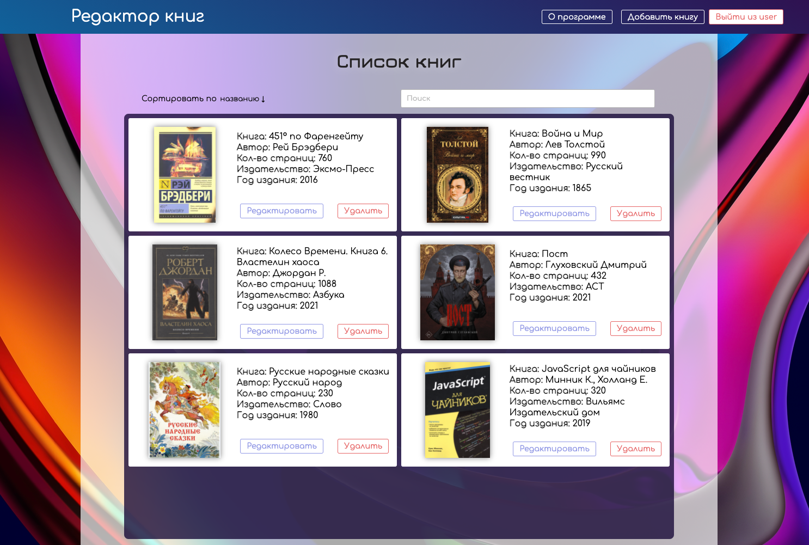

### BOOKS:

> Небольшое приложение работающее на фронте. 
> Основной функционал - создание списка книг и дальнейшее его редактирование. Требования к приложению описаны во вкладке "О программе"
> Используемые технологии: HTML, SCSS, React, Redux, Typescript, Redux Thunk. 

Ссылка на программу: 

> https://shellipov.github.io/books/#/

Для запуска программы: 

> Скачать репозиторий.

> Перейти в папку с репозиторием

> В корсоли ввести npm i или yarn для установки всех необходимых пакетов

> В корсоли ввести npm start или yarn start для запуска приложения
